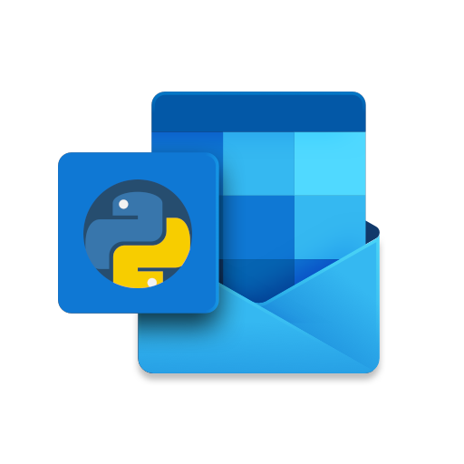

# Outlook-Python-Tutorial
Welcome to a series of tutorials on how to get the most out of Microsoft Outlook using python!  

## Table of Contents
<table>
<tr>
    <td>
        <ul><b>
            <li><a href="https://github.com/israel-dryer/Outlook-Python-Tutorial/wiki">Home</a></li>
            <li><a href="https://github.com/israel-dryer/Outlook-Python-Tutorial/wiki/Getting-started">Getting started</a></li>
            <li><a href="https://github.com/israel-dryer/Outlook-Python-Tutorial/wiki/Plain-text-email">Plain text email</a></li>
            <li><a href="https://github.com/israel-dryer/Outlook-Python-Tutorial/wiki/HTML-formatted-email">HMTL formatted email</a></li>
            <li><a href="https://github.com/israel-dryer/Outlook-Python-Tutorial/wiki/Attachments">Attachments</a></li>
            <li><a href="https://github.com/israel-dryer/Outlook-Python-Tutorial/wiki/Email-templates">Email templates</a></li>                                    
            <li><a href="https://github.com/israel-dryer/Outlook-Python-Tutorial/wiki/Email-sending-limits">Sending limits</a></li>
            <li><a href="https://github.com/israel-dryer/Outlook-Python-Tutorial/wiki/Navigating-folders">Navigating folders</a></li>
            <li><a href="https://github.com/israel-dryer/Outlook-Python-Tutorial/wiki/Bulk-mail">Bulk mail</a></li>                                    
        </ul></b>
    </td>
    <td>
        
    </td>
</tr>
